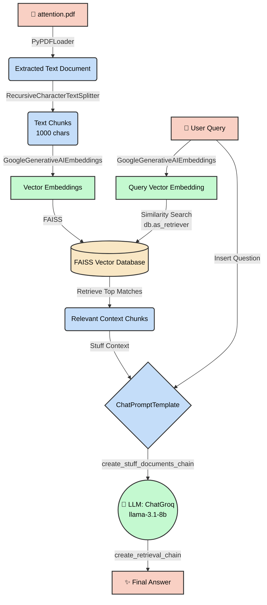

# RAG Workflow Diagram

This document contains a Mermaid diagram illustrating the step-by-step Retrieval-Augmented Generation (RAG) process that occurs in the `chain.ipynb` notebook.

You can view this diagram using a Markdown previewer in your IDE that supports Mermaid, or on GitHub.

### Key Components
1. **Red/Pink Blocks**: Inputs and Outputs (Files, Queries, Answers).
2. **Blue Blocks**: LangChain Processing steps (Loaders, Splitters, Prompts).
3. **Green Blocks**: AI Models generating data (Google Embeddings, Groq LLM).
4. **Yellow/Orange Block**: The Vector Database (FAISS).
