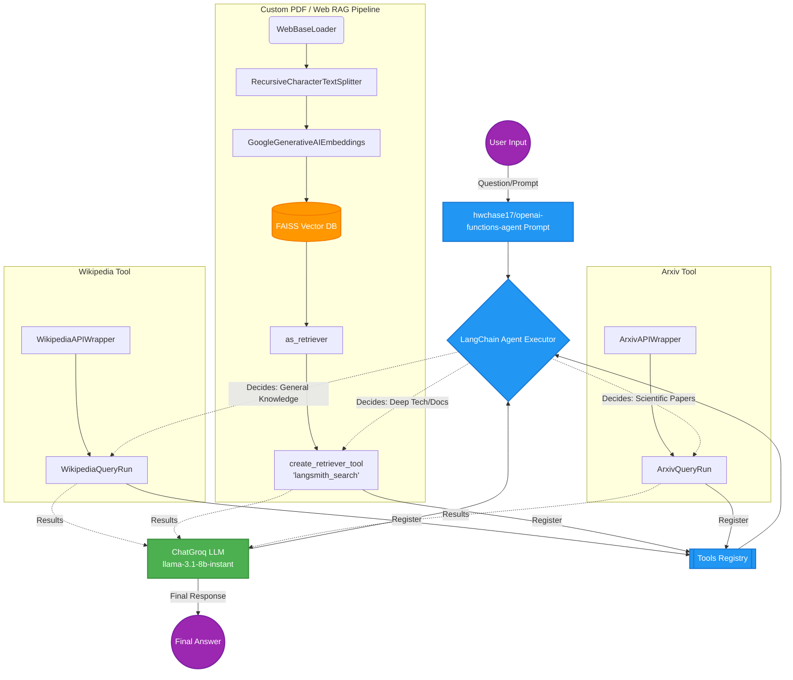

# Multi-Data Source RAG Agent Workflow

This diagram illustrates the step-by-step workflow of the intelligent tool-calling agent designed in `agents.ipynb`. The agent orchestrates between three separate data retrieval systems to determine the best source of information based on a user's prompt.

### Flow Breakdown:
1. **Data Ingestion (Bottom Layer):** The notebook establishes three separate pipelines: Wikipedia API for natural-language facts, Arxiv API for academic publications, and a FAISS database containing document embeddings scraped from Langsmith docs.
2. **Tool Consolidation:** The three disparate data pipelines are wrapped into uniform LangChain "Tools".
3. **Core Orchestration:** The `AgentExecutor` takes the user prompt, utilizes Groq's high-speed logical reasoning capacity (`ChatGroq`), and dynamically chooses *which* tool to query based on what information is needed to fulfill the instruction.
4. **Final Synthesis:** The returned raw data from the chosen tool is fed back to the underlying LLM, which synthesizes a robust, natural-sounding answer for the user.
